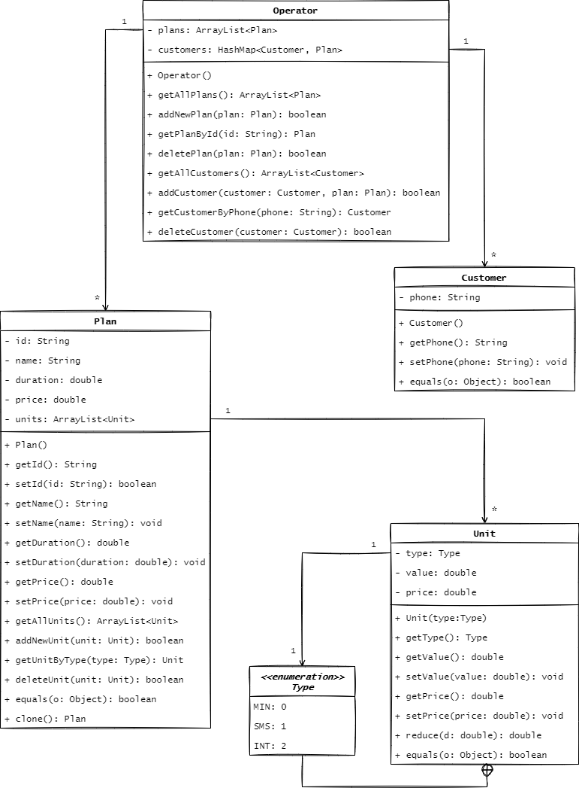

# Система мобильной связи на Java

Работа выполнена в рамках курса "Разработка Объектно Ориентированных Систем".

Лабораторная работа **№ 3-4**. Разработка программ с использованием принципа единственной обязанности (SRP).

Вариант **А**. Задача **12**. Мобильная связь. Определить иерархию тарифов мобильной  компании. Создать список тарифов компании. Подсчитать общую численность клиентов. Провести сортировку тарифов на основе размера абонентской платы. Найти тариф в компании, соответствующий заданному диапазону параметров.

### Диаграмма классов проекта

[](diagram.png)

### Запуск и проверка

Для удобства просмотра исходного кода используйте [`VS Code Online`](https://vscode.dev/https://github.com/satarovbekzhan/cellular-communication) (возможно потребуется вход в аккаунт).

Для проверки работоспособности каждого класса специально написаны тесты. Чтобы запустить тесты, сперва убедитесь, что у вас установлена минимальная требуемая версия Java (в данном проекте использована версия `java 11.0.11 2021-04-20 LTS`):

```ps
$ java --version

java 11.0.11 2021-04-20 LTS
Java(TM) SE Runtime Environment 18.9 (build 11.0.11+9-LTS-194)
Java HotSpot(TM) 64-Bit Server VM 18.9 (build 11.0.11+9-LTS-194, mixed mode)
```

Затем перейдите в корень проекта и запустите команду ниже:

```ps
$ ./gradlew test

BUILD SUCCESSFUL in 853ms
4 actionable tasks: 4 up-to-date
```
